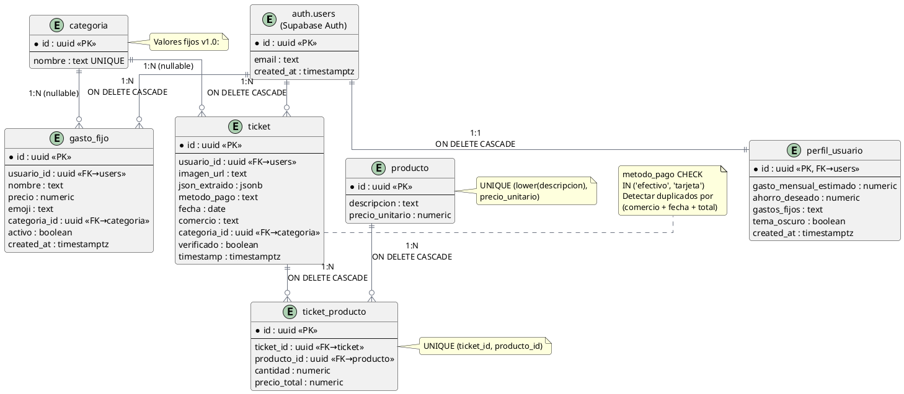

# Diagrama Entidad-Relación — Scannet

Base de datos PostgreSQL alojada en Supabase.
Generado: 2026-05-23

---

---

## Notas de diseño

| Decisión | Motivo |
|----------|--------|
| `producto` separado de `ticket_producto` | Normalización: evita duplicar descripción/precio en cada ticket |
| `categoria` fija en v1.0 | Simplifica categorización LLM; personalizable en v2.0 |
| `json_extraido` jsonb | Preserva el raw del OCR para re-entrenamiento futuro |
| `verificado` boolean | Solo datos confirmados por el usuario se usan para métricas |
| `perfil_usuario` 1:1 con `auth.users` | Extiende el usuario Supabase sin modificar `auth.users` |
