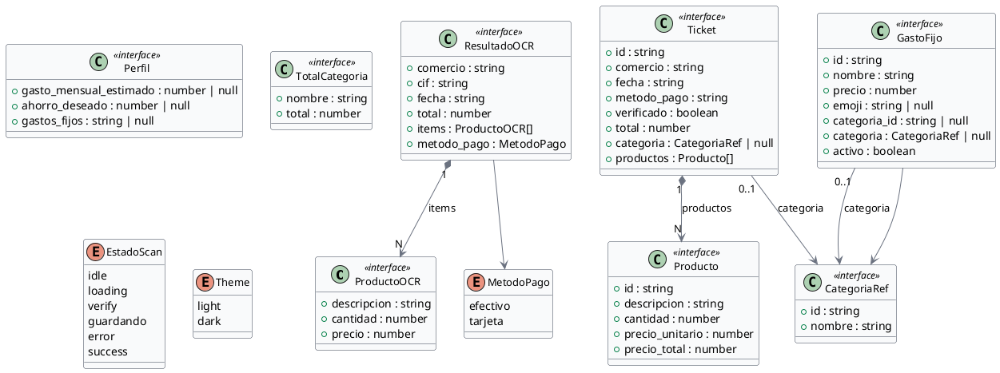
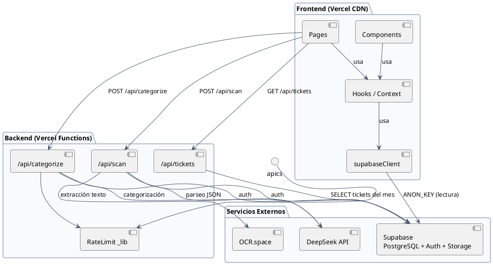

# Diagrama de Clases — Scannet

Frontend React + Vercel Functions (Node.js).
Generado: 2026-05-23

---

## 1. Interfaces de Dominio (TypeScript)

---

## 2. Contexto y Hooks (lógica de estado)

```plantuml
@startuml Scannet_Hooks

skinparam classBackgroundColor #EFF6FF
skinparam classBorderColor #3B82F6
skinparam classFontSize 13
skinparam arrowColor #6B7280
skinparam roundcorner 6

' ─────────────────────────────────────────────────
' ScanContext — estado global del flujo de escaneo
' ─────────────────────────────────────────────────

class ScanContext <<Context>> {
  + estado : EstadoScan
  + resultado : ResultadoOCR | null
  + errorMsg : string | null
  + duplicado : boolean
  + imagenPreview : string | null
  + tiempoOCR : number | null
  + metodoPago : MetodoPago
  --
  + setMetodoPago(m : MetodoPago) : void
  + enviar(imageBlob : Blob) : Promise<void>
  + guardar(datos : ResultadoOCR) : Promise<void>
  + reintentar() : void
  + cancelar() : void
}

note right of ScanContext
  Llama a POST /api/scan
  Llama a POST /api/categorize
  INSERT en ticket + ticket_producto
  Estado persiste entre navegaciones
end note

' ─────────────────────────────────────────────────
' useAuth — sesión Supabase
' ─────────────────────────────────────────────────

class useAuth <<Hook>> {
  + user : User | null
  + session : Session | null
  + loading : boolean
  --
  + signUp(email, password) : Promise<void>
  + signIn(email, password) : Promise<void>
  + signOut() : Promise<void>
}

' ─────────────────────────────────────────────────
' useTickets — datos del mes en curso
' ─────────────────────────────────────────────────

class useTickets <<Hook>> {
  + tickets : Ticket[]
  + totalesPorCategoria : Record<string, TotalCategoria>
  + totalMes : number
  + loading : boolean
  + error : string | null
  --
  + refetch() : void
}

note right of useTickets
  Llama a GET /api/tickets
  Datos del mes en curso únicamente
end note

' ─────────────────────────────────────────────────
' usePerfil — configuración del usuario
' ─────────────────────────────────────────────────

class usePerfil <<Hook>> {
  + perfil : Perfil | null
  + loading : boolean
}

note right of usePerfil
  Lee perfil_usuario de Supabase
end note

' ─────────────────────────────────────────────────
' useGastosFijos — CRUD gastos recurrentes
' ─────────────────────────────────────────────────

class useGastosFijos <<Hook>> {
  + gastosFijos : GastoFijo[]
  + categorias : CategoriaRef[]
  + loading : boolean
  --
  + crear(data : NuevoGasto) : Promise<boolean>
  + actualizar(id : string, data : Partial<NuevoGasto>) : Promise<boolean>
  + eliminar(id : string) : Promise<boolean>
}

' ─────────────────────────────────────────────────
' useTheme — tema visual
' ─────────────────────────────────────────────────

class useTheme <<Hook>> {
  + theme : Theme
  --
  + toggle() : void
}

' ─────────────────────────────────────────────────
' useScan — re-export de ScanContext
' ─────────────────────────────────────────────────

class useScan <<Hook>> {
}

useScan ..> ScanContext : re-exports

@enduml
```

---

## 3. Componentes React (vista)

```plantuml
@startuml Scannet_Componentes

skinparam classBackgroundColor #F0FDF4
skinparam classBorderColor #22C55E
skinparam classFontSize 12
skinparam arrowColor #6B7280
skinparam roundcorner 6

' ─────────────────────────────────────────────────
' Páginas (Pages)
' ─────────────────────────────────────────────────

class Login <<Page>> {
  ' Formulario email + contraseña
  + render() : JSX
}

class Registro <<Page>> {
  ' Registro de nueva cuenta
  + render() : JSX
}

class Onboarding <<Page>> {
  ' Configuración inicial del perfil
  + render() : JSX
}

class Home <<Page>> {
  ' Dashboard: gráfica + desglose
  - tickets : Ticket[]
  - totalesPorCategoria : Record
  - totalMes : number
  - perfil : Perfil | null
  - gastosFijos : GastoFijo[]
  --
  + render() : JSX
}

class Scan <<Page>> {
  ' Flujo completo de escaneo
  - estado : EstadoScan
  - imagenPreview : string | null
  --
  + render() : JSX
}

class Cuenta <<Page>> {
  ' Ajustes de cuenta y logout
  + render() : JSX
}

' ─────────────────────────────────────────────────
' Componentes reutilizables
' ─────────────────────────────────────────────────

class AppLayout <<Component>> {
  ' Contenedor principal
  ' Sidebar + Outlet + BottomNav
  + render() : JSX
}

class Sidebar <<Component>> {
  ' Navegación lateral (desktop)
  + render() : JSX
}

class BottomNav <<Component>> {
  ' Navegación inferior (móvil)
  + render() : JSX
}

class ProtectedRoute <<Component>> {
  ' Guarda de ruta — redirige a /login si no hay sesión
  + render() : JSX
}

class VerifyForm <<Component>> {
  ' Formulario editable post-OCR
  - resultado : ResultadoOCR
  --
  + onConfirm(datos : ResultadoOCR) : void
  + render() : JSX
}

class DonutChart <<Component>> {
  ' Gráfica de dona (Recharts)
  - data : TotalCategoria[]
  --
  + onSelectCategoria(nombre : string) : void
  + render() : JSX
}

class CategoriaList <<Component>> {
  ' Lista de categorías con totales
  - categorias : TotalCategoria[]
  --
  + onSelectCategoria(nombre : string) : void
  + render() : JSX
}

class DrillDown <<Component>> {
  ' Detalle de categoría seleccionada
  - categoria : string
  - tickets : Ticket[]
  - gastosFijos : GastoFijo[]
  --
  + render() : JSX
}

class GastosFijosModal <<Component>> {
  ' Modal CRUD de gastos fijos
  - gastosFijos : GastoFijo[]
  - categorias : CategoriaRef[]
  --
  + render() : JSX
}

class EmptyState <<Component>> {
  ' Placeholder cuando no hay datos
  + render() : JSX
}

' ─────────────────────────────────────────────────
' Relaciones de composición
' ─────────────────────────────────────────────────

AppLayout *--> Sidebar
AppLayout *--> BottomNav

Home *--> DonutChart
Home *--> CategoriaList
Home *--> DrillDown
Home *--> GastosFijosModal
Home *--> EmptyState

Scan *--> VerifyForm

' ─────────────────────────────────────────────────
' Dependencias de hooks
' ─────────────────────────────────────────────────

Home ..> useTickets    : usa
Home ..> usePerfil     : usa
Home ..> useGastosFijos : usa

Scan ..> useScan       : usa

Login ..> useAuth      : usa
Registro ..> useAuth   : usa
Cuenta ..> useAuth     : usa

AppLayout ..> useTheme : usa
ProtectedRoute ..> useAuth : usa

@enduml
```

---

## 4. API — Vercel Functions

```plantuml
@startuml Scannet_API

skinparam classBackgroundColor #FFF7ED
skinparam classBorderColor #F97316
skinparam classFontSize 13
skinparam arrowColor #6B7280
skinparam roundcorner 6

' ─────────────────────────────────────────────────
' Endpoints
' ─────────────────────────────────────────────────

class "POST /api/scan" as scan <<VercelFunction>> {
  + Input: image : base64
  + Input: mimeType : string
  + Input: metodo_pago : MetodoPago
  --
  - validarAuth() : User
  - aplicarRateLimit(userId, 10/min)
  - llamarOCRSpace(image) : textoRaw
  - llamarDeepSeekChat(textoRaw) : ResultadoOCR
  --
  + Output: ResultadoOCR
}

note right of scan
  Flujo:
  1. Auth + Rate Limit
  2. OCR.space → texto plano
  3. DeepSeek chat → JSON
  4. Validar schema (comercio+total requeridos)
end note

class "POST /api/categorize" as categorize <<VercelFunction>> {
  + Input: comercio : string
  + Input: items : ProductoOCR[]
  --
  - validarAuth() : User
  - aplicarRateLimit(userId, 30/min)
  - llamarDeepSeekChat(prompt) : string
  - validarCategoria(resp) : string
  --
  + Output: { categoria : string }
}

note right of categorize
  Categorías válidas:
  'Alimentación', 'Transporte',
  'Ocio', 'Hogar', 'Salud', 'Otros'
end note

class "GET /api/tickets" as tickets <<VercelFunction>> {
  + Input: Authorization header
  --
  - validarAuth() : User
  - calcularRangoMes() : { inicio, fin }
  - consultarSupabase() : Ticket[]
  - calcularTotalesPorCategoria()
  --
  + Output: { tickets[], totalesPorCategoria{}, totalMes }
}

note right of tickets
  JOIN: ticket → ticket_producto
       → producto → categoria
  Solo mes en curso (v1.0)
end note

class RateLimit <<_lib>> {
  - store : Map<string, WindowEntry>
  --
  + check(key : string, limit : number) : boolean
}

note right of RateLimit
  Ventana deslizante 60s
  Almacenado en memoria serverless
end note

scan --> RateLimit : usa
categorize --> RateLimit : usa

' ─────────────────────────────────────────────────
' Servicios externos
' ─────────────────────────────────────────────────

class "OCR.space API" as ocrspace <<ExternalService>> {
  + extractText(imageBase64) : string
}

class "DeepSeek API\n(LLM Chat)" as deepseek <<ExternalService>> {
  + chat(messages, temperature) : string
}

class "Supabase\n(PostgreSQL + Auth)" as supabase <<ExternalService>> {
  + auth.getUser(token) : User
  + from(table).select() : Query
  + from(table).insert() : Query
}

scan --> ocrspace : llama
scan --> deepseek : llama (parseo)
categorize --> deepseek : llama (clasificación)
tickets --> supabase : consulta
scan --> supabase : auth
categorize --> supabase : auth

@enduml
```

---

## Resumen de relaciones entre capas

